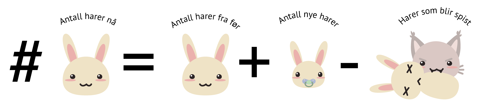

# Kodeillustrasjoner

Dette er en samling med illustrasjoner for programmering- og realfagsundervisning laget av Marie Roald. 
Alle illustrasjoner lisensert med en Attribution-NonCommercial-ShareAlike 4.0 lisens.

## Kan jeg bruke illustrasjonene ...
### i undervisning i skolen eller på universitet?
Ja, så fremt du krediterer meg og denne nettsiden.

### i undervisningsmateriell?
Ja, men hvis du deler dette materiellet med andre er det 3 kriterier:
 1. Materiellet må være gratis
 1. Du må kreditere meg
 1. Materiellet må gis ut med samme lisens som figurene [(CC BY-SA-NC)](https://creativecommons.org/licenses/by-nc-sa/4.0/)

### til noe jeg eller arbeidsgiveren min skal tjene penger på?
Da må du kontakte meg og be om lov først.

## Utvalgte illustrasjoner:

### Robot og barn koder
#### Robot baker

#### Robot leser bok

#### Robot bygger lego

#### Barn koder

### Arrays
#### Indeksering

### Derivasjon
#### Stoppeklokker

#### Fart

#### Array slicing

### Rovdyr byttedyr
#### Byttedyr-likninger

#### Rovdyr-likninger

#### Øyillustrasjoner

### Finne pi fra dartkast

En PowerPoint presentasjon som bruker disse illustrasjonene for å forklare hvordan man kan estimere pi fra dartkast kan du finne på GitHub siden til [Kodeskolen sitt kurs for Teknalærere](https://github.com/kodeskolen/tekna_v20). Presentasjonen er [her](https://github.com/kodeskolen/tekna_v20/blob/master/dag1/pi_estimering_slides.pptx)